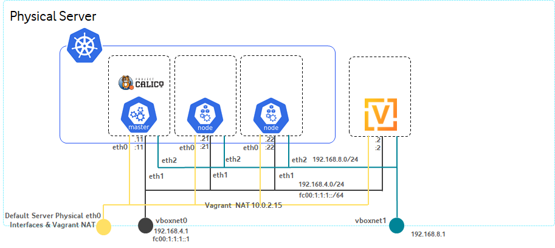
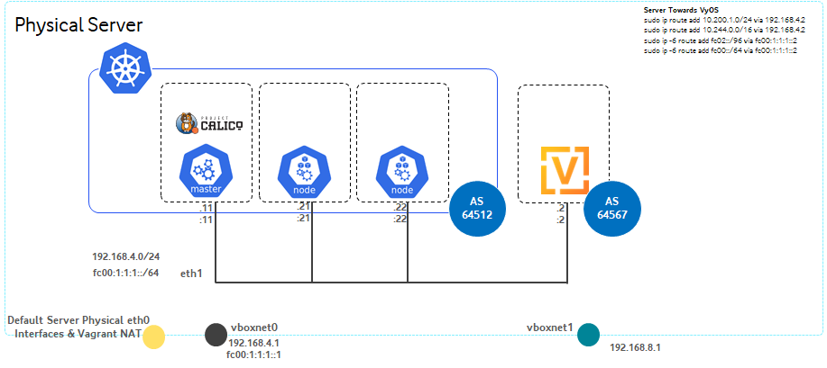

# kubernetes

In order to follow this tutorial, you'll need the following :

1. MacOS / Linux / Window x64 with Virtualization Enabled with at least 14 GB of RAM free
   1. Kubernetes Master, minimum 4GB of RAM, 2vCPUs
   2. Kubernetes Node1, minimum 4GB of RAM, 2vCPUs
   3. Kubernetes Node2, minimum 4GB of RAM, 2vCPUs
   4. VyOS Router for BGP, minimum 2GB of RAM, 2vCPUs
2. Vagrant (hashicorp)
3. Oracle Virtual-Box
4. **Administrator rights**

and you'll also need the following files:

- [ ] Vagrantfile
- [ ] m1.sh
- [ ] n1.sh
- [ ] n2.sh
- [ ] calico.yaml -> patched eth1, vagrant use eth0



<u>**command to run in MacOS / Linux**</u>

```shell
sudo apt install vagrant -y
```

if using Linux
Install Virtual Box for Ubuntu 20.04 (focal), and linux-headers based on kernel version

<u>**command to run in Linux**</u>

```shell
wget -q https://www.virtualbox.org/download/oracle_vbox_2016.asc -O- | sudo apt-key add -
wget -q https://www.virtualbox.org/download/oracle_vbox.asc -O- | sudo apt-key add -
echo "deb [arch=amd64] http://download.virtualbox.org/virtualbox/debian focal contrib" | sudo tee /etc/apt/sources.list.d/virtualbox.list

sudo apt update
sudo apt install linux-headers-$(uname -r) dkms -y
sudo apt-get install virtualbox-6.1 -y
```

## Network Requirement

last but not least, you'll need 2 host-only interface, host-only interface is a virtual interface that connect directly between the Hypervisor and the VM:

* vboxnet0 (192.168.4.1/24, fc00:1:1:1::1/64)
* vboxnet1 (192.168.8.1/24)


<u>**command to run in MacOS / Linux**</u>

```shell
sudo vboxmanage hostonlyif create
sudo vboxmanage hostonlyif create
```

add standard route from Linux / MacOS to include Pods IP ```10.244.0.0/16, fc00::/64``` and MetalLB Subnet ```10.200.1.0/24, fc02::/64``` IP towards VyOS ```192.168.4.2``` and ```fc00:1:1:1::2```

<u>**command to run in MacOS / Linux**</u>

```shell
sudo ip route add 10.200.1.0/24 via 192.168.4.2
sudo ip route add 10.244.0.0/16 via 192.168.4.2
sudo ip -6 route add fc02::/96 via fc00:1:1:1::2
sudo ip -6 route add fc00::/64 via fc00:1:1:1::2
```

next you should run deploy vagrant by running this script.

<u>**command to run in MacOS/Linux/Windows**</u>

```shell
vagrant up m1 n1 n2 vyos
```

congratulations, you had just install 1 kubernetes master and 2 kubernetes nodes, and vyOS with calico enabled
run vyos.sh inside vyos to enable BGP and configure the IP address



### Installing Calicoctl as binary

next we should install calicoctl binary inside kubernetes master

**<u>command to run inside m1</u>**

```bash
curl -O -L https://github.com/projectcalico/calicoctl/releases/download/v3.17.1/calicoctl
chmod +x calicoctl
sudo mv calicoctl /usr/local/bin/
```


## Configure Calico to use BGP

in this step, we'll make sure Calico will peer with VyOS by using BGP with Local AS ```64512``` Remote AS ```64567``` , we'll not using calico bgp router reflector, but we'll fullmesh configuration, for kubernetes cluster with nodes < 50, shouldn't be an issue.

Full Mesh means:

> * Master will peer with node1, node2 and VyOS
> * node1 will peer with master, node2 and VyOS
> * node2 will peer with master, node1 and VyOS
> * VyOS will peer with master, node1 and node2.


the first thing to do is to disable the default nodeToNodeMesh.

**<u>command to run in m1</u>**

```shell
calicoctl patch bgpconfiguration default -p '{"spec": {"nodeToNodeMeshEnabled": false}}'
```

next we need to prepare ```calicobgp.yaml``` and ```calicobgpipv6.yaml``` , in here you can see the peering IP address will be the IP address of VyOS Router 192.168.4.2 and fc00:1:1:1::2

as we also plan to use MetalLB as our Load balancer, we should also prepare the serviceIP so it will be routed through BGP by creating ```calicoserviceip.yaml```

**<u>command to run in m1</u>**

```yaml
bash -c 'cat << EOF > calicobgp.yaml
apiVersion: projectcalico.org/v3
kind: BGPPeer
metadata:
  name: my-global-peer
spec:
  peerIP: 192.168.4.2
  asNumber: 64567
EOF'
```

**<u>command to run in m1</u>**

```yaml
bash -c 'cat << EOF > calicobgpipv6.yaml
apiVersion: projectcalico.org/v3
kind: BGPPeer
metadata:
  name: my-global-peer-ipv6
spec:
  peerIP: fc00:1:1:1::2
  asNumber: 64567
EOF'
```

**<u>command to run in m1</u>**

```yaml
bash -c 'cat << EOF > calicoserviceip.yaml
apiVersion: projectcalico.org/v3
kind: BGPConfiguration
metadata:
  name: default
spec:
  serviceClusterIPs:
  - cidr: 10.200.1.0/24
  - cidr: fc02::/96
  - cidr: 10.96.0.0/12
  - cidr: fc01::/108
EOF'
```

Apply the configuration 

**<u>command to run in m1</u>**

```shell
calicoctl apply -f - < calicobgp.yaml
calicoctl apply -f - < calicobgpipv6.yaml
calicoctl apply -f - < calicoserviceip.yaml
sudo calicoctl node status
```


## Configure VyOS and enable BGP

next you'll need to configure VyOS and connect to the kubernetes nodes AS 

**<u>command to run inside vyos</u>**

```shell
sudo su -
bash -c 'cat <<EOF> sysctladd.conf
net.ipv6.conf.eth1.accept_dad = 0
net.ipv6.conf.default.accept_dad = 0
net.ipv6.conf.eth1.dad_transmits = 0
net.ipv6.conf.default.dad_transmits = 0
EOF'
sudo cat sysctladd.conf >> /etc/sysctl.conf
sysctl -p
exit

configure
set protocols bgp 64567 parameters router-id 192.168.4.2
set protocols bgp 64567 neighbor 192.168.4.11 remote-as '64512'
set protocols bgp 64567 neighbor 192.168.4.21 remote-as '64512'
set protocols bgp 64567 neighbor 192.168.4.22 remote-as '64512'
commit
save
exit

configure
set interfaces ethernet eth1 address fc00:1:1:1::2/64
set interfaces ethernet eth1 address 192.168.4.2/24
set protocols bgp 64567 address-family ipv6-unicast network fc00:1:1:1::/64
set protocols bgp 64567 neighbor fc00:1:1:1::11 remote-as '64512'
set protocols bgp 64567 neighbor fc00:1:1:1::21 remote-as '64512'
set protocols bgp 64567 neighbor fc00:1:1:1::22 remote-as '64512'
set protocols bgp 64567 neighbor fc00:1:1:1::11 update-source fc00:1:1:1::2
set protocols bgp 64567 neighbor fc00:1:1:1::21 update-source fc00:1:1:1::2
set protocols bgp 64567 neighbor fc00:1:1:1::22 update-source fc00:1:1:1::2
set protocols bgp 64567 neighbor fc00:1:1:1::11 address-family ipv6-unicast
set protocols bgp 64567 neighbor fc00:1:1:1::21 address-family ipv6-unicast
set protocols bgp 64567 neighbor fc00:1:1:1::22 address-family ipv6-unicast
commit
save
exit
```


## Install MetalLB Load Balancer

Load balancer, if we have a look at the definition as per wikipedia.

> Load Balancing refers to the process of distributing a set of tasks over a set of resources (computing units), with the aim of making their overall processing more efficient.

MetalLB is one of the Bare Metal load balancer, it can operator on Layer 2, and it's supporting BGP. in our scenario, we'll rely BGP from Calico, and use MetalLB in Layer 2 Mode

to install MetalLB, we should first check our kubernetes deployment and verify the strictARP.

**<u>command to run inside m1</u>**

```shell
kubectl get configmap kube-proxy -n kube-system -o yaml | \
sed -e "s/strictARP: false/strictARP: true/" | \
kubectl diff -f - -n kube-system
```


now after we do the comparison, it's time for us to enable strictARP: true

**<u>command to run inside m1</u>**

```yaml
kubectl get configmap kube-proxy -n kube-system -o yaml | \
sed -e "s/strictARP: false/strictARP: true/" | \
kubectl apply -f - -n kube-system
```

after we modify strictARP to true, we should now be able to install MetalLB

**<u>command to run inside m1</u>**

```
kubectl apply -f https://raw.githubusercontent.com/metallb/metallb/v0.9.5/manifests/namespace.yaml
kubectl apply -f https://raw.githubusercontent.com/metallb/metallb/v0.9.5/manifests/metallb.yaml
```

MetalLB should also require secret, so it should be created

**<u>command to run inside m1</u>**

```
kubectl create secret generic -n metallb-system memberlist --from-literal=secretkey="$(openssl rand -base64 128)"
```

**<u>command to run inside m1 to create metallbLayer2.yaml</u>**

```
bash -c 'cat << EOF > metallbLayer2.yaml
apiVersion: v1
kind: ConfigMap
metadata:
  namespace: metallb-system
  name: config
data:
  config: |
    address-pools:
    - name: default
      protocol: layer2
      addresses:
      - 10.200.1.10-10.200.1.200
      - fc02::10-fc02::200
EOF'
```


**<u>command to run inside m1</u>**

```
kubectl apply -f metallbLayer2.yaml
```

## Install NGINX Ingress Controller

```bash
helm repo add ingress-nginx https://kubernetes.github.io/ingress-nginx
helm repo update
kubectl create ns nginx-ingress
helm install ingress-nginx ingress-nginx/ingress-nginx -n nginx-ingress
```

## Installing Istio Service Mesh

this step below will install istio in your cluster

binary for istio, current release 1.8.2

```shell
curl -L https://istio.io/downloadIstio | sh -
cd istio-1.8.2
echo "export PATH=$PWD/bin:$PATH" >> ~/.profile
source ~/.profile
```

then you'll need to create `istio-system` namespace

```shell
kubectl create namespace istio-system
```

next you'll need to install istio base chart for istio control plane

```shell
helm install -n istio-system istio-base manifests/charts/base
```

then istio discovery chart current release `1.8.2`

```shell
helm install -n istio-system istiod manifests/charts/istio-control/istio-discovery --set global.hub="docker.io/istio" --set global.tag="1.8.2"
```

ingress & egress component

```shell
helm install -n istio-system istio-ingress manifests/charts/gateways/istio-ingress --set global.hub="docker.io/istio" --set global.tag="1.8.2"
helm install -n istio-system istio-egress manifests/charts/gateways/istio-egress --set global.hub="docker.io/istio" --set global.tag="1.8.2"
```

```shell
kubectl get pods -n istio-system
```

install kiali-server

```shell
helm install -n istio-system --set auth.strategy="anonymous" --repo https://kiali.org/helm-charts kiali-server kiali-server
```

testing istio by creating a new namespace with istio-injection enabled by default

```shell
kubectl create namespace istio-test
kubectl label namespace istio-test istio-injection=enabled
kubectl get namespace -L istio-injection
```

## Install Jaeger, Grafana, Prometheus, Zipkin using Quick Start Method.

Jaeger, Grafana, Prometheus, Zipkin can be installed using quick start into istio, but we can also use external jaeger, prometheus, but for this testing, we'll deployed jaeger, grafana into our cluster, by default, during the installation using istio-discovery telemetry is already enabled by default. Option1. Quick-Start

```
kubectl apply -f https://raw.githubusercontent.com/istio/istio/release-1.8/samples/addons/grafana.yaml
kubectl apply -f https://raw.githubusercontent.com/istio/istio/release-1.8/samples/addons/jaeger.yaml
kubectl apply -f https://raw.githubusercontent.com/istio/istio/release-1.8/samples/addons/prometheus.yaml
kubectl apply -f https://raw.githubusercontent.com/istio/istio/release-1.8/samples/addons/extras/zipkin.yaml
```

## Install Registry

before you start this, you need to have at least container storage interface available.

Install Rook for providing ceph storage, rook require at least 3 nodes for pods scheduling, our solutions contain only 2 nodes, remove the taint from master node and enable it for pod scheduling

```bash
kubectl taint nodes --all node-role.kubernetes.io/master-
helm repo add rook-release https://charts.rook.io/release
kubectl create namespace rook-ceph
helm install --namespace rook-ceph rook-ceph rook-release/rook-ceph

git clone --single-branch --branch v1.5.5 https://github.com/rook/rook.git
cd rook/cluster/examples/kubernetes/ceph
#kubectl create -f crds.yaml -f common.yaml -f operator.yaml
kubectl apply -f cluster.yaml
kubectl apply -f toolbox.yaml
```

verify Rook Installation

```bash
kubectl -n rook-ceph rollout status deploy/rook-ceph-tools
```

### Create Storage class

```bash
cd rook/cluster/examples/kubernetes/ceph/csi/rbd/
kubectl apply -f storageclass.yaml
```

set our new storage class as default

```bash
kubectl patch storageclass rook-ceph-block -p '{"metadata": {"annotations":{"storageclass.kubernetes.io/is-default-class":"true"}}}'
```

after having Rook available to provide storage like `ceph` you can continue to install registry, in this case `Harbor` or `trow`

to install Harbor

```bash
helm repo add harbor https://helm.goharbor.io
helm install my-harbor harbor/harbor
#helm install my-harbor harbor/harbor --set persistence.persistentVolumeClaim.registry.storageClass=rook-ceph-block --set persistence.persistentVolumeClaim.jobservice.storageClass=rook-ceph-block --set persistence.persistentVolumeClaim.database.storageClass=rook-ceph-block --set persistence.persistentVolumeClaim.redis.storageClass=rook-ceph-block --set persistence.persistentVolumeClaim.trivy.storageClass=rook-ceph-block --set persistence.persistentVolumeClaim.chartmuseum.storageClass=rook-ceph-block
```

to install trow

```bash
helm repo add trow https://trow.io
helm install trow trow/trow
```


